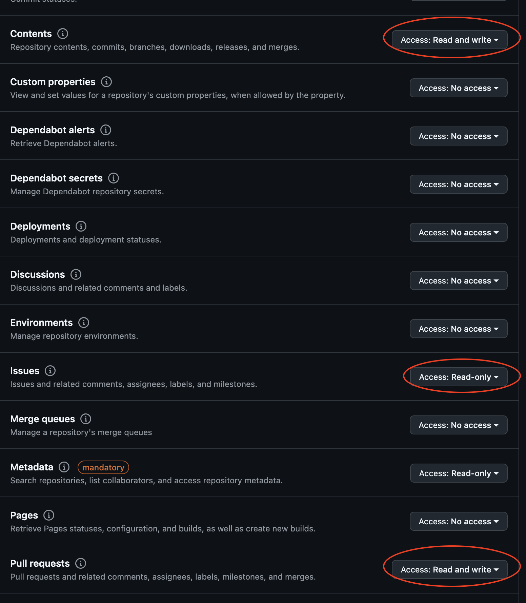

# Llama Stack Apps Coding Agent

This is a coding agent specifically tailored to Llama models. It's a project to see how far we can take Llama models for coding.

Built on [llama-stack](https://github.com/meta-llama/llama-stack)

## Prerequisites
- A github account
- git
- python 3.10

## Setup

Create an environment with the dependencies:

```bash
conda create -n llama-stack-coding-agent python=3.10
conda activate llama-stack-coding-agent
# python -m venv .venv should also work here as well but this is only tested on python 3.10 so ymmv
```

- Go to https://github.com/settings/personal-access-tokens/new
  - Fill in name
  - Select the repositories you want it to have access to

- Add the following permissions:


Security concerns:
- Note that the agent will only create a new branch and create a PR. It won't push to the main branch or edit any existing PRs/Issues
- Note that the agent won't close/merge PRs or close issues/edit issues - it will only read from the issue and create a PR
- Nor will it push to the main branch, it will create a new branch
- The agent does not execute any bash commands or git commands, it only reads and writes files
- The agent does not have access to any bash commands or ability to run arbitrary code, it can only read and write files in the sandbox/ directory
- The agent also cannot read or edit any files outside of the sandbox/ directory (including any symlinks)
- The app however performs git commands and hits the github api to create a new branch and create a PR after the agent has finished running.


Copy the .env.example file to .env

```bash
cp .env.example .env
```

- Add your github token to the .env file

```bash
GITHUB_TOKEN=github_pat_11SDF...
```

- This only supports 3.3 70B model at the moment

Run a llama-stack distribution, we use fireworks in this example, but you can use any other distribution that supports the 3.3 70B model:
```bash
# Run a llama-stack distribution
export LLAMA_STACK_PORT=5000
# You can get an api key from https://fireworks.ai/account/api-keys
export FIREWORKS_API_KEY=__your_fireworks_api_key_here__
docker run -it \
  -p $LLAMA_STACK_PORT:$LLAMA_STACK_PORT \
  -v ~/.llama:/root/.llama \
  llamastack/distribution-fireworks \
  --port $LLAMA_STACK_PORT \
  --env FIREWORKS_API_KEY=$FIREWORKS_API_KEY
```

- Run the agent, giving it the issue url you want solved (ensuring that the api key has access to that repo)

```bash
python -m llama_agent.main \
--issue https://github.com/aidando73/bitbucket-syntax-highlighting/issues/67
```

- The agent will create a PR with the changes it has made
- If the agent fails to create a PR, it will create a comment on the issue with the reasoning trace.
- Note that this is a very simple agent and is not perfect, it is a proof of concept, so it may not always work.

Evals can be found in: https://huggingface.co/datasets/aidando73/llama-codes-swe-bench-evals/tree/main